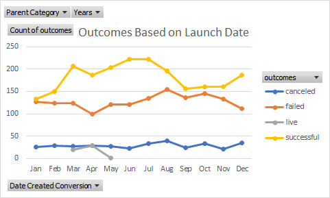
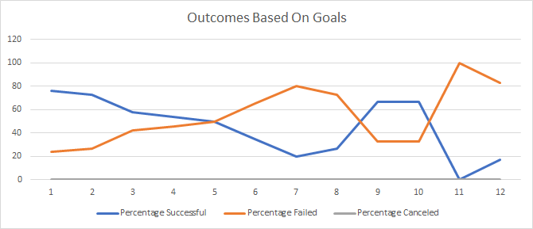

## Overview of Project
Analyzed campaign outcomes based on goals and launch dates.
### Purpose
Create tables and chart visualizations on how an outcome succeeded, failed or canceled compared by the launch dates and another comparison by goals based on price range.
## Analysis and Challenges

### Analysis of Outcomes Based on Launch Date
I performed my analysis by creating a new sheet that displayed a pivot table from the main dataset that displayed the successful, failed and canceled outcomes based on the launch dates. 

### Analysis of Outcomes Based on Goals
Another form of analysis I did was pulling data from the main dataset and then creating a table that showed the count of the successful, failed, and canceled outcomes based on the campaign goals' price range. 

### Challenges and Difficulties Encountered
Some challenges that arose from this was grouping the rows of the launch dates, but I was able to get through it by making sure that only the years were showing to create a much more organized looking pivot table. From the pivot table, I was able to create a pivot chart that clearly shows a better visualization on the information extracted from the pivot table. Another challenge was creating the =COUNTIFSformula and filtering the right columns and the price ranges of the goals. In the end I was able to create a line chart that shows information that clearly shows a summary of the percentage calculated of the successful, failed and canceled outcomes based on the campaign goals' price range.
## Results

- What are two conclusions you can draw about the Outcomes based on Launch Date?
The line chart shows that the most successful campaigns were the campaigns launched around May and June. The least successful campaigns were between December and January. 
- What can you conclude about the Outcomes based on Goals?
You can surmise that the lower the goal for a campaign, the higher the success rate is for a campaign.
- What are some limitations of this dataset?
Some limitations to this dataset is that there is not much information on canceled pledges from the dataset.
- What are some other possible tables and/or graphs that we could create?
Some other tables and graphs that could be created from this dataset is to create a new column that compares the conversion prices of each play to a standard USD then creating a new table to see the success of the campaigns in a line chart with those values and comparing it to the success and failure. 
